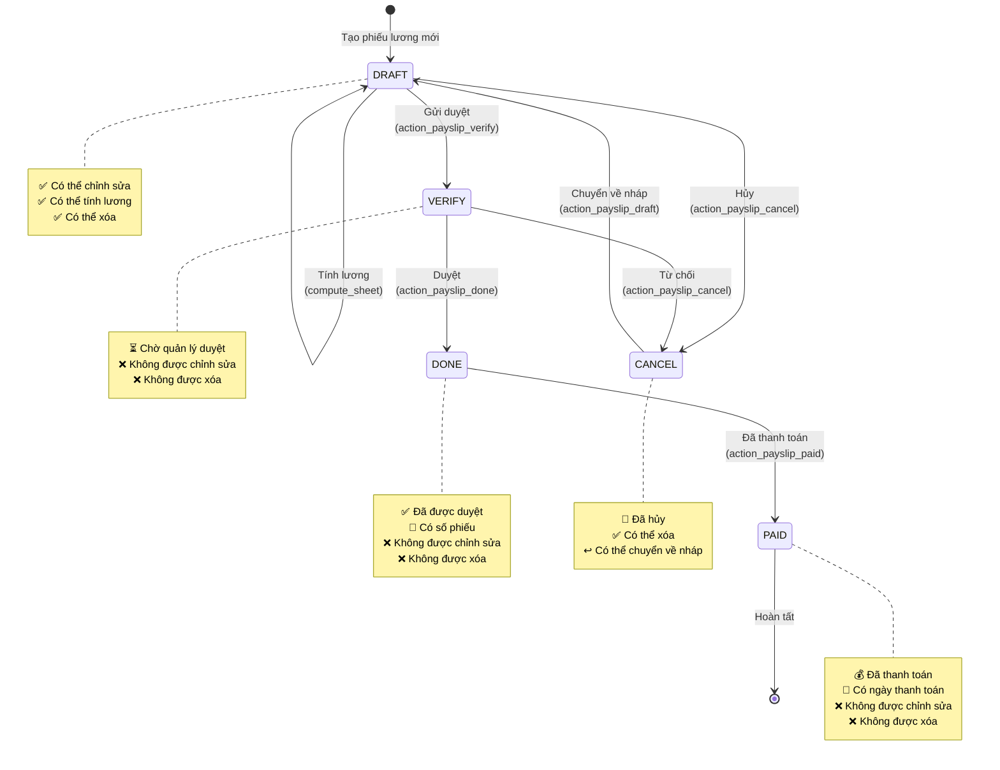

```mermaid
stateDiagram-v2
    [*] --> DRAFT: Tạo phiếu lương mới
    
    DRAFT --> DRAFT: Tính lương<br/>(compute_sheet)
    DRAFT --> VERIFY: Gửi duyệt<br/>(action_payslip_verify)
    DRAFT --> CANCEL: Hủy<br/>(action_payslip_cancel)
    
    VERIFY --> DONE: Duyệt<br/>(action_payslip_done)
    VERIFY --> CANCEL: Từ chối<br/>(action_payslip_cancel)
    
    DONE --> PAID: Đã thanh toán<br/>(action_payslip_paid)
    
    CANCEL --> DRAFT: Chuyển về nháp<br/>(action_payslip_draft)
    
    PAID --> [*]: Hoàn tất
    
    note right of DRAFT
        ✅ Có thể chỉnh sửa
        ✅ Có thể tính lương
        ✅ Có thể xóa
    end note
    
    note right of VERIFY
        ⏳ Chờ quản lý duyệt
        ❌ Không được chỉnh sửa
        ❌ Không được xóa
    end note
    
    note right of DONE
        ✅ Đã được duyệt
        📝 Có số phiếu
        ❌ Không được chỉnh sửa
        ❌ Không được xóa
    end note
    
    note right of PAID
        💰 Đã thanh toán
        📅 Có ngày thanh toán
        ❌ Không được chỉnh sửa
        ❌ Không được xóa
    end note
    
    note right of CANCEL
        🚫 Đã hủy
        ✅ Có thể xóa
        ↩️ Có thể chuyển về nháp
    end note
```
